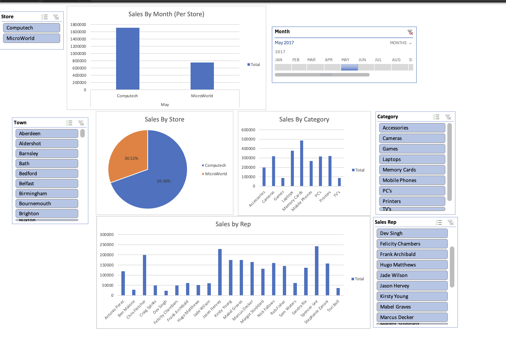

# Electronics Company Sales Dashboard

## Overview
This project presents an interactive dashboard built using Excel Pivot Charts and Slicers to analyze the sales performance of an electronics company operating through two main stores and multiple branches. The dataset includes 21,575 rows of sales data spanning from January to June, providing valuable insights into sales trends, team performance, and customer behavior.

## Key Insights & KPIs Visualized
- Total Sales by Store
- Monthly Sales Trends
- Sales Performance by Representative
- Sales by Product Category
- Sales by Town / Branch

## Tools & Techniques Used
- Microsoft Excel (Mac)
- Pivot Tables & Pivot Charts
- Slicers for interactive filtering
- Timeline filter for date-based analysis

## Dataset Summary
- Total Records: 21,575
- Key Fields:
  - Month, Store, Town, Sales Rep, Category, Sales
- The data was cleaned and transformed inside Excel using standard filtering and formatting techniques.

## Screenshots
- Dashboard Overview

